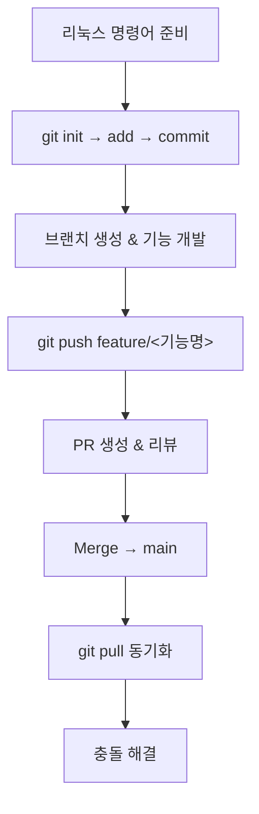

# Git & GitHub 완전 정복 가이드

## 1. 필수 리눅스 명령어

| 명령어            | 설명                    |
| -------------- | --------------------- |
| `pwd`          | 현재 작업 디렉터리 경로 출력      |
| `ls` / `ls -a` | 파일·폴더 목록 (숨김 파일 포함)   |
| `cd <폴더>`      | 디렉터리 이동               |
| `mkdir <이름>`   | 새 디렉터리 생성             |
| `touch <파일>`   | 새 파일 생성 (타임스탬프 변경 포함) |

## 2. Git vs GitHub

* **Git**: 로컬 분산 버전 관리 시스템 (커밋·브랜치·머지)
* **GitHub**: Git 저장소 호스팅 서비스 (원격 백업·협업·이슈 트래킹·Pull Request 기능 제공)

## 3. Git 기본 워크플로우 & 필수 명령어

| 단계        | 명령어                                            | 설명                    |
| --------- | ---------------------------------------------- | --------------------- |
| 저장소 초기화   | `git init`                                     | 새 로컬 저장소(.git 폴더) 생성  |
| 상태 확인     | `git status`                                   | 변경사항 및 스테이징 상태 확인     |
| 스테이징      | `git add <파일>` / `git add .`                   | 변경 파일을 Staging 영역에 추가 |
| 커밋        | `git commit -m "메시지"`                          | Staging된 변경사항을 커밋     |
| 히스토리 조회   | `git log`                                      | 커밋 로그 확인              |
| 브랜치 생성·전환 | `git switch -c feature/<기능명>`                  | 새 브랜치 생성 및 전환         |
| 브랜치 병합    | `git switch main`<br>`git merge feature/<기능명>` | 기능 브랜치를 main 브랜치에 병합  |

## 4. 원격 저장소 연동 & 백업

```bash
# 원격 저장소 등록 및 기본 브랜치 설정
git remote add origin <원격-URL>
git branch -M main
git push -u origin main  # 최초 푸시 및 업스트림 설정

# 이후 작업 흐름
git add . && git commit -m "요약"
git push origin feature/<기능명>
git pull origin main      # 원격 변경사항 동기화
```

## 5. Pull Request 기반 협업

```bash
# 1) 기능 브랜치 생성 및 전환
git switch -c feature/<기능명>

# 2) 코드 작성 후 커밋 및 푸시
git add .
git commit -m "작업 요약"
git push origin feature/<기능명>
```

1. GitHub 웹 UI에서 **Compare & pull request** 클릭
2. 리뷰어 지정 및 변경 사항 설명 후 **Create pull request** 클릭
3. 리뷰 반영:

   ```bash
   git add .
   git commit -m "Refine based on review"
   git push origin feature/<기능명>
   ```
4. GitHub 웹 UI에서 **Merge pull request** 클릭
5. 로컬 동기화:

   ```bash
   git switch main
   git pull origin main
   ```

## 6. 충돌(Conflict) 해결

충돌은 `git merge` 또는 `git pull` 중 동일 구역이 다르게 수정됐을 때 발생합니다.

충돌 마커(`<<<<<<<`, `=======`, `>>>>>>>`) 제거 후 원하는 코드로 병합:

```diff
<<<<<<< HEAD
내 변경 내용
=======
상대 변경 내용
>>>>>>> feature/<기능명>
```

수정 완료 후:

```bash
git add <파일>
git commit -m "Resolve merge conflict"
git push origin main
```

## 7. 전체 워크플로우 요약



이 가이드 하나로 **리눅스 명령어**, **Git 로컬 워크플로우**, **GitHub 원격 연동**, **브랜치·Pull Request 협업**, **충돌 해결**까지 완벽하게 마스터할 수 있습니다!
